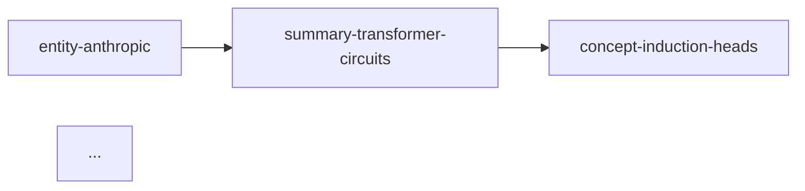

# /memex:graph

Emit a graph of `wiki page → wiki page` references. Feeds the "is this page orphaned?" and "what are the hubs?" questions.

## Usage

```
/memex:graph                    # default: mermaid
/memex:graph --format mermaid
/memex:graph --format dot
/memex:graph --format json
```

## Behaviour

1. Glob all `.md` files under the ops root (exclude `.state/**`)
2. For each file, parse:
   - markdown links `[text](path.md)` → edge to that file (resolve relative path)
   - wikilinks `[[slug]]` → edge to the page whose `slug:` frontmatter matches
3. Build the edge list
4. Render per format:

### `mermaid`



### `dot`

```
digraph memex {
  "entity-anthropic" -> "summary-transformer-circuits";
  "summary-transformer-circuits" -> "concept-induction-heads";
}
```

### `json`

```json
{
  "nodes": [{"slug": "...", "path": "...", "type": "..."}, ...],
  "edges": [{"from": "...", "to": "..."}, ...]
}
```

5. Offer to save the output to `<ops-root>/.audits/<DDMMYYYY-HHMM>/graph.{mmd|dot|json}`

## Bonus: orphan / hub callouts

After emitting the graph, print a summary:

- **Orphans** (zero inbound edges): list
- **Hubs** (≥ 5 inbound edges): list
- **Dead ends** (zero outbound edges): list (often fine for leaf concepts; worth checking)

Nothing in this command is blocking — it's a read-only analysis.
